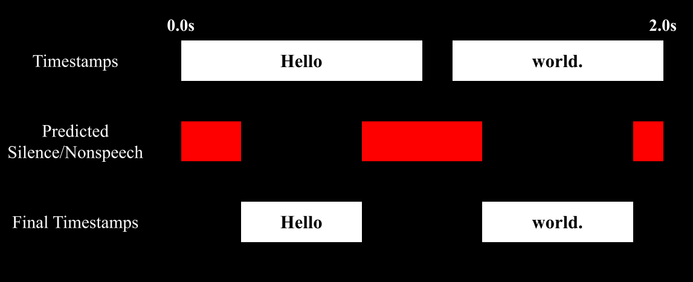
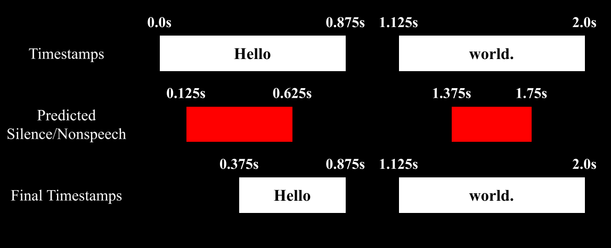

# Stabilizing Timestamps for Whisper

This library modifies [Whisper](https://github.com/openai/whisper) to produce more reliable timestamps and extends its functionality.

https://github.com/jianfch/stable-ts/assets/28970749/7adf0540-3620-4b2b-b2d4-e316906d6dfa

* [Setup](#setup)
* [Usage](#usage)
  * [Transcribe](#transcribe)
  * [Output](#output)
  * [Alignment](#alignment)
    * [Adjustments](#adjustments)
  * [Refinement](#refinement)
  * [Regrouping Words](#regrouping-words)
  * [Editing](#editing)
  * [Locating Words](#locating-words)
  * [Silence Suppression](#silence-suppression)
    * [Gap Adjustment](#gap-adjustment)
  * [Tips](#tips)
  * [Visualizing Suppression](#visualizing-suppression)
  * [Encode Comparison](#encode-comparison)
  * [Use with any ASR](#any-asr)
* [Quick 1.X → 2.X Guide](#quick-1x--2x-guide)

## Setup
<details>
<summary>Prerequisites: FFmpeg & PyTorch</summary>

<details>
<summary>FFmpeg</summary>

Requires [FFmpeg](https://ffmpeg.org/) in PATH 
```
# on Ubuntu or Debian
sudo apt update && sudo apt install ffmpeg

# on Arch Linux
sudo pacman -S ffmpeg

# on MacOS using Homebrew (https://brew.sh/)
brew install ffmpeg

# on Windows using Chocolatey (https://chocolatey.org/)
choco install ffmpeg

# on Windows using Scoop (https://scoop.sh/)
scoop install ffmpeg
```
</details>

<details>
<summary>PyTorch</summary>

If PyTorch is not installed when installing Stable-ts, 
the default version will be installed which may not have GPU support.
To avoid this issue, install your preferred version with instructions at https://pytorch.org/get-started/locally/.
</details>

</details>

```
pip install -U stable-ts
```

To install the latest commit:
```
pip install -U git+https://github.com/jianfch/stable-ts.git
```

<details>
<summary>Whisperless Version</summary>

To install Stable-ts without Whisper as a dependency:
```
pip install -U stable-ts-whisperless
```
To install the latest Whisperless commit:
```
pip install -U git+https://github.com/jianfch/stable-ts.git@whisperless
```
</details>

## Usage

### Transcribe

```python
import stable_whisper
model = stable_whisper.load_model('base')
result = model.transcribe('audio.mp3')
result.to_srt_vtt('audio.srt')
```
<details>
<summary>CLI</summary>

```commandline
stable-ts audio.mp3 -o audio.srt
```
</details>

Docstrings:
<details>
<summary>load_model()</summary>

    Load an instance if :class:`whisper.model.Whisper`.

    Parameters
    ----------
    name : {'tiny', 'tiny.en', 'base', 'base.en', 'small', 'small.en', 'medium', 'medium.en', 'large-v1',
        'large-v2', 'large-v3', or 'large'}
        One of the official model names listed by :func:`whisper.available_models`, or
        path to a model checkpoint containing the model dimensions and the model state_dict.
    device : str or torch.device, optional
        PyTorch device to put the model into.
    download_root : str, optional
        Path to download the model files; by default, it uses "~/.cache/whisper".
    in_memory : bool, default False
        Whether to preload the model weights into host memory.
    cpu_preload : bool, default True
        Load model into CPU memory first then move model to specified device
        to reduce GPU memory usage when loading model
    dq : bool, default False
        Whether to apply Dynamic Quantization to model to reduced memory usage and increase inference speed
        but at the cost of a slight decrease in accuracy. Only for CPU.
    engine : str, optional
        Engine for Dynamic Quantization.

    Returns
    -------
    model : "Whisper"
        The Whisper ASR model instance.

    Notes
    -----
    The overhead from ``dq = True`` might make inference slower for models smaller than 'large'.

</details>

<details>
<summary>transcribe()</summary>

    Transcribe audio using Whisper.

    This is a modified version of :func:`whisper.transcribe.transcribe` with slightly different decoding logic while
    allowing additional preprocessing and postprocessing. The preprocessing performed on the audio includes:
    voice isolation / noise removal and low/high-pass filter. The postprocessing performed on the transcription
    result includes: adjusting timestamps with VAD and custom regrouping segments based punctuation and speech gaps.

    Parameters
    ----------
    model : whisper.model.Whisper
        An instance of Whisper ASR model.
    audio : str or numpy.ndarray or torch.Tensor or bytes or AudioLoader
        Path/URL to the audio file, the audio waveform, or bytes of audio file or
        instance of :class:`stable_whisper.audio.AudioLoader`.
        If audio is :class:`numpy.ndarray` or :class:`torch.Tensor`, the audio must be already at sampled to 16kHz.
    verbose : bool or None, default False
        Whether to display the text being decoded to the console.
        Displays all the details if ``True``. Displays progressbar if ``False``. Display nothing if ``None``.
    temperature : float or iterable of float, default (0.0, 0.2, 0.4, 0.6, 0.8, 1.0)
        Temperature for sampling. It can be a tuple of temperatures, which will be successfully used
        upon failures according to either ``compression_ratio_threshold`` or ``logprob_threshold``.
    compression_ratio_threshold : float, default 2.4
        If the gzip compression ratio is above this value, treat as failed.
    logprob_threshold : float, default -1
        If the average log probability over sampled tokens is below this value, treat as failed
    no_speech_threshold : float, default 0.6
        If the no_speech probability is higher than this value AND the average log probability
        over sampled tokens is below ``logprob_threshold``, consider the segment as silent
    condition_on_previous_text : bool, default True
        If ``True``, the previous output of the model is provided as a prompt for the next window;
        disabling may make the text inconsistent across windows, but the model becomes less prone to
        getting stuck in a failure loop, such as repetition looping or timestamps going out of sync.
    initial_prompt : str, optional
        Text to provide as a prompt for the first window. This can be used to provide, or
        "prompt-engineer" a context for transcription, e.g. custom vocabularies or proper nouns
        to make it more likely to predict those word correctly.
    word_timestamps : bool, default True
        Extract word-level timestamps using the cross-attention pattern and dynamic time warping,
        and include the timestamps for each word in each segment.
        Disabling this will prevent segments from splitting/merging properly.
    regroup : bool or str, default True, meaning the default regroup algorithm
        String for customizing the regrouping algorithm. False disables regrouping.
        Ignored if ``word_timestamps = False``.
    suppress_silence : bool, default True
        Whether to enable timestamps adjustments based on the detected silence.
    suppress_word_ts : bool, default True
        Whether to adjust word timestamps based on the detected silence. Only enabled if ``suppress_silence = True``.
    use_word_position : bool, default True
        Whether to use position of the word in its segment to determine whether to keep end or start timestamps if
        adjustments are required. If it is the first word, keep end. Else if it is the last word, keep the start.
    q_levels : int, default 20
        Quantization levels for generating timestamp suppression mask; ignored if ``vad = true``.
        Acts as a threshold to marking sound as silent.
        Fewer levels will increase the threshold of volume at which to mark a sound as silent.
    k_size : int, default 5
        Kernel size for avg-pooling waveform to generate timestamp suppression mask; ignored if ``vad = true``.
        Recommend 5 or 3; higher sizes will reduce detection of silence.
    denoiser : str, optional
        String of the denoiser to use for preprocessing ``audio``.
        See ``stable_whisper.audio.SUPPORTED_DENOISERS`` for supported denoisers.
    denoiser_options : dict, optional
        Options to use for ``denoiser``.
    vad : bool or dict, default False
        Whether to use Silero VAD to generate timestamp suppression mask.
        Instead of ``True``, using a dict of keyword arguments will load the VAD with the arguments.
        Silero VAD requires PyTorch 1.12.0+. Official repo, https://github.com/snakers4/silero-vad.
    vad_threshold : float, default 0.35
        Threshold for detecting speech with Silero VAD. Low threshold reduces false positives for silence detection.
    min_word_dur : float or None, default None meaning use ``stable_whisper.default.DEFAULT_VALUES``
        Shortest duration each word is allowed to reach for silence suppression.
    min_silence_dur : float, optional
        Shortest duration of silence allowed for silence suppression.
    nonspeech_error : float, default 0.1
        Relative error of non-speech sections that appear in between a word for silence suppression.
    only_voice_freq : bool, default False
        Whether to only use sound between 200 - 5000 Hz, where majority of human speech are.
    prepend_punctuations : str or None, default None meaning use ``stable_whisper.default.DEFAULT_VALUES``
        Punctuations to prepend to next word.
    append_punctuations : str or None, default None meaning use ``stable_whisper.default.DEFAULT_VALUES``
        Punctuations to append to previous word.
    stream : bool or None, default None
        Whether to loading ``audio`` in chunks of 30 seconds until the end of file/stream.
        If ``None`` and ``audio`` is a string then set to ``True`` else ``False``.
    mel_first : bool, optional
        Process entire audio track into log-Mel spectrogram first instead in chunks.
        Used if odd behavior seen in stable-ts but not in whisper, but use significantly more memory for long audio.
    split_callback : Callable, optional
        Custom callback for grouping tokens up with their corresponding words.
        The callback must take two arguments, list of tokens and tokenizer.
        The callback returns a tuple with a list of words and a corresponding nested list of tokens.
    suppress_ts_tokens : bool, default False
        Whether to suppress timestamp tokens during inference for timestamps are detected at silent.
        Reduces hallucinations in some cases, but also prone to ignore disfluencies and repetitions.
        This option is ignored if ``suppress_silence = False``.
    gap_padding : str, default ' ...'
        Padding prepend to each segments for word timing alignment.
        Used to reduce the probability of model predicting timestamps earlier than the first utterance.
    only_ffmpeg : bool, default False
        Whether to use only FFmpeg (instead of not yt-dlp) for URls
    max_instant_words : float, default 0.5
        If percentage of instantaneous words in a segment exceed this amount, the segment is removed.
    avg_prob_threshold: float or None, default None
        Transcribe the gap after the previous word and if the average word proababiliy of a segment falls below this
        value, discard the segment. If ``None``, skip transcribing the gap to reduce chance of timestamps starting
        before the next utterance.
    nonspeech_skip : float or None, default None
        Skip non-speech sections that are equal or longer than this duration in seconds. Disable skipping if ``None``.
        Reduce text and timing hallucinations in non-speech sections but may increase processing time.
    progress_callback : Callable, optional
        A function that will be called when transcription progress is updated.
        The callback need two parameters.
        The first parameter is a float for seconds of the audio that has been transcribed.
        The second parameter is a float for total duration of audio in seconds.
    ignore_compatibility : bool, default False
        Whether to ignore warnings for compatibility issues with the detected Whisper version.
    extra_models : list of whisper.model.Whisper, optional
        List of additional Whisper model instances to use for computing word-timestamps along with ``model``.
    dynamic_heads : bool or int or str, optional
        Whether to find optimal cross-attention heads during runtime instead of using the predefined heads for 
        word-timestamp extraction. Specify the number of heads or `True` for default of 6 heads.
        To specify number of iterations for finding the optimal heads,
        use string with "," to separate heads and iterations (e.g. "8,3" for 8 heads and 3 iterations).
    decode_options
        Keyword arguments to construct class:`whisper.decode.DecodingOptions` instances.

    Returns
    -------
    stable_whisper.result.WhisperResult
        All timestamps, words, probabilities, and other data from the transcription of ``audio``.

    See Also
    --------
    stable_whisper.non_whisper.transcribe_any : Return :class:`stable_whisper.result.WhisperResult` containing all the
        data from transcribing audio with unmodified :func:`whisper.transcribe.transcribe` with preprocessing and
        postprocessing.
    stable_whisper.whisper_word_level.faster_whisper.faster_transcribe : Return
        :class:`stable_whisper.result.WhisperResult` containing all the data from transcribing audio with
        :meth:`faster_whisper.WhisperModel.transcribe` with preprocessing and postprocessing.

    Examples
    --------
    >>> import stable_whisper
    >>> model = stable_whisper.load_model('base')
    >>> result = model.transcribe('audio.mp3', vad=True)
    >>> result.to_srt_vtt('audio.srt')
    Saved: audio.srt

</details>

<details>
<summary>transcribe_minimal()</summary>

    Transcribe audio using Whisper.

    This is uses the original whisper transcribe function, :func:`whisper.transcribe.transcribe`, while still allowing
    additional preprocessing and postprocessing. The preprocessing performed on the audio includes: voice isolation /
    noise removal and low/high-pass filter. The postprocessing performed on the transcription result includes:
    adjusting timestamps with VAD and custom regrouping segments based punctuation and speech gaps.

    Parameters
    ----------
    model : whisper.model.Whisper
        An instance of Whisper ASR model.
    audio : str or numpy.ndarray or torch.Tensor or bytes
        Path/URL to the audio file, the audio waveform, or bytes of audio file.
        If audio is ``numpy.ndarray`` or ``torch.Tensor``, the audio must be already at sampled to 16kHz.
    verbose : bool or None, default False
        Whether to display the text being decoded to the console.
        Displays all the details if ``True``. Displays progressbar if ``False``. Display nothing if ``None``.
    word_timestamps : bool, default True
        Extract word-level timestamps using the cross-attention pattern and dynamic time warping,
        and include the timestamps for each word in each segment.
        Disabling this will prevent segments from splitting/merging properly.
    regroup : bool or str, default True, meaning the default regroup algorithm
        String for customizing the regrouping algorithm. False disables regrouping.
        Ignored if ``word_timestamps = False``.
    suppress_silence : bool, default True
        Whether to enable timestamps adjustments based on the detected silence.
    suppress_word_ts : bool, default True
        Whether to adjust word timestamps based on the detected silence. Only enabled if ``suppress_silence = True``.
    use_word_position : bool, default True
        Whether to use position of the word in its segment to determine whether to keep end or start timestamps if
        adjustments are required. If it is the first word, keep end. Else if it is the last word, keep the start.
    q_levels : int, default 20
        Quantization levels for generating timestamp suppression mask; ignored if ``vad = true``.
        Acts as a threshold to marking sound as silent.
        Fewer levels will increase the threshold of volume at which to mark a sound as silent.
    k_size : int, default 5
        Kernel size for avg-pooling waveform to generate timestamp suppression mask; ignored if ``vad = true``.
        Recommend 5 or 3; higher sizes will reduce detection of silence.
    denoiser : str, optional
        String of the denoiser to use for preprocessing ``audio``.
        See ``stable_whisper.audio.SUPPORTED_DENOISERS`` for supported denoisers.
    denoiser_options : dict, optional
        Options to use for ``denoiser``.
    vad : bool or dict, default False
        Whether to use Silero VAD to generate timestamp suppression mask.
        Instead of ``True``, using a dict of keyword arguments will load the VAD with the arguments.
        Silero VAD requires PyTorch 1.12.0+. Official repo, https://github.com/snakers4/silero-vad.
    vad_threshold : float, default 0.35
        Threshold for detecting speech with Silero VAD. Low threshold reduces false positives for silence detection.
    min_word_dur : float, default 0.1
        Shortest duration each word is allowed to reach for silence suppression.
    min_silence_dur : float, optional
        Shortest duration of silence allowed for silence suppression.
    nonspeech_error : float, default 0.1
        Relative error of non-speech sections that appear in between a word for silence suppression.
    only_voice_freq : bool, default False
        Whether to only use sound between 200 - 5000 Hz, where majority of human speech are.
    only_ffmpeg : bool, default False
        Whether to use only FFmpeg (instead of not yt-dlp) for URls
    options
        Additional options used for :func:`whisper.transcribe.transcribe` and
        :func:`stable_whisper.non_whisper.transcribe_any`.
    Returns
    -------
    stable_whisper.result.WhisperResult
        All timestamps, words, probabilities, and other data from the transcription of ``audio``.

    Examples
    --------
    >>> import stable_whisper
    >>> model = stable_whisper.load_model('base')
    >>> result = model.transcribe_minimal('audio.mp3', vad=True)
    >>> result.to_srt_vtt('audio.srt')
    Saved: audio.srt

</details>

<br>
<details>
<summary>faster-whisper</summary>

Use with [faster-whisper](https://github.com/guillaumekln/faster-whisper):
```
pip install -U stable-ts[fw]
```
```python
model = stable_whisper.load_faster_whisper('base')
result = model.transcribe_stable('audio.mp3')
```
```commandline
stable-ts audio.mp3 -o audio.srt -fw
```
Docstring:
<details>
<summary>load_faster_whisper()</summary>

    Load an instance of :class:`faster_whisper.WhisperModel`.

    Parameters
    ----------
    model_size_or_path : {'tiny', 'tiny.en', 'base', 'base.en', 'small', 'small.en', 'medium', 'medium.en', 'large-v1',
        'large-v2', 'large-v3', or 'large'}
        Size of the model.

    model_init_options
        Additional options to use for initialization of :class:`faster_whisper.WhisperModel`.

    Returns
    -------
    faster_whisper.WhisperModel
        A modified instance with :func:`stable_whisper.whisper_word_level.load_faster_whisper.faster_transcribe`
        assigned to :meth:`faster_whisper.WhisperModel.transcribe_stable`.

</details>

<details>
<summary>transcribe_stable()</summary>

    Transcribe audio using faster-whisper (https://github.com/guillaumekln/faster-whisper).

    This is uses the transcribe method from faster-whisper, :meth:`faster_whisper.WhisperModel.transcribe`, while
    still allowing additional preprocessing and postprocessing. The preprocessing performed on the audio includes:
    voice isolation / noise removal and low/high-pass filter. The postprocessing performed on the
    transcription result includes: adjusting timestamps with VAD and custom regrouping segments based punctuation
    and speech gaps.

    Parameters
    ----------
    model : faster_whisper.WhisperModel
        The faster-whisper ASR model instance.
    audio : str or numpy.ndarray or torch.Tensor or bytes
        Path/URL to the audio file, the audio waveform, or bytes of audio file.
        If audio is :class:`numpy.ndarray` or :class:`torch.Tensor`, the audio must be already at sampled to 16kHz.
    verbose : bool or None, default False
        Whether to display the text being decoded to the console.
        Displays all the details if ``True``. Displays progressbar if ``False``. Display nothing if ``None``.
    word_timestamps : bool, default True
        Extract word-level timestamps using the cross-attention pattern and dynamic time warping,
        and include the timestamps for each word in each segment.
        Disabling this will prevent segments from splitting/merging properly.
    regroup : bool or str, default True, meaning the default regroup algorithm
        String for customizing the regrouping algorithm. False disables regrouping.
        Ignored if ``word_timestamps = False``.
    suppress_silence : bool, default True
        Whether to enable timestamps adjustments based on the detected silence.
    suppress_word_ts : bool, default True
        Whether to adjust word timestamps based on the detected silence. Only enabled if ``suppress_silence = True``.
    use_word_position : bool, default True
        Whether to use position of the word in its segment to determine whether to keep end or start timestamps if
        adjustments are required. If it is the first word, keep end. Else if it is the last word, keep the start.
    q_levels : int, default 20
        Quantization levels for generating timestamp suppression mask; ignored if ``vad = true``.
        Acts as a threshold to marking sound as silent.
        Fewer levels will increase the threshold of volume at which to mark a sound as silent.
    k_size : int, default 5
        Kernel size for avg-pooling waveform to generate timestamp suppression mask; ignored if ``vad = true``.
        Recommend 5 or 3; higher sizes will reduce detection of silence.
    denoiser : str, optional
        String of the denoiser to use for preprocessing ``audio``.
        See ``stable_whisper.audio.SUPPORTED_DENOISERS`` for supported denoisers.
    denoiser_options : dict, optional
        Options to use for ``denoiser``.
    vad : bool or dict, default False
        Whether to use Silero VAD to generate timestamp suppression mask.
        Instead of ``True``, using a dict of keyword arguments will load the VAD with the arguments.
        Silero VAD requires PyTorch 1.12.0+. Official repo, https://github.com/snakers4/silero-vad.
    vad_threshold : float, default 0.35
        Threshold for detecting speech with Silero VAD. Low threshold reduces false positives for silence detection.
    min_word_dur : float or None, default None meaning use ``stable_whisper.default.DEFAULT_VALUES``
        Shortest duration each word is allowed to reach for silence suppression.
    min_silence_dur : float, optional
        Shortest duration of silence allowed for silence suppression.
    nonspeech_error : float, default 0.3
        Relative error of non-speech sections that appear in between a word for silence suppression.
    only_voice_freq : bool, default False
        Whether to only use sound between 200 - 5000 Hz, where majority of human speech are.
    only_ffmpeg : bool, default False
        Whether to use only FFmpeg (instead of not yt-dlp) for URls
    check_sorted : bool, default True
        Whether to raise an error when timestamps returned by faster-whipser are not in ascending order.
    progress_callback : Callable, optional
        A function that will be called when transcription progress is updated.
        The callback need two parameters.
        The first parameter is a float for seconds of the audio that has been transcribed.
        The second parameter is a float for total duration of audio in seconds.
    options
        Additional options used for :meth:`faster_whisper.WhisperModel.transcribe` and
        :func:`stable_whisper.non_whisper.transcribe_any`.

    Returns
    -------
    stable_whisper.result.WhisperResult
        All timestamps, words, probabilities, and other data from the transcription of ``audio``.

    Examples
    --------
    >>> import stable_whisper
    >>> model = stable_whisper.load_faster_whisper('base')
    >>> result = model.transcribe_stable('audio.mp3', vad=True)
    >>> result.to_srt_vtt('audio.srt')
    Saved: audio.srt

</details>

</details>


<details>
<summary>Hugging Face Transformers (~9x faster)</summary>

Run Whisper up to 9x faster with [Hugging Face Transformer](https://huggingface.co/openai/whisper-large-v3):
```
pip install -U stable-ts[hf]
```
```python
model = stable_whisper.load_hf_whisper('base')
result = model.transcribe('audio.mp3')
```

<details>
<summary>CLI</summary>

```commandline
stable-ts audio.mp3 -o audio.srt -hw
```
</details>

</details>

### Output

https://github.com/jianfch/stable-ts/assets/28970749/c22dcdf9-79cb-485a-ae38-184d006e513e

Stable-ts supports various text output formats.
```python
result.to_srt_vtt('audio.srt') #SRT
result.to_srt_vtt('audio.vtt') #VTT
result.to_ass('audio.ass') #ASS
result.to_tsv('audio.tsv') #TSV
```
Docstrings:
<details>
<summary>result_to_srt_vtt()</summary>

    Generate SRT/VTT from ``result`` to display segment-level and/or word-level timestamp.

    Parameters
    ----------
    result : dict or list or stable_whisper.result.WhisperResult
        Result of transcription.
    filepath : str, default None, meaning content will be returned as a ``str``
        Path to save file.
    segment_level : bool, default True
        Whether to use segment-level timestamps in output.
    word_level : bool, default True
        Whether to use word-level timestamps in output.
    min_dur : float, default 0.2
        Minimum duration allowed for any word/segment before the word/segments are merged with adjacent word/segments.
    tag: tuple of (str, str), default None, meaning ('<font color="#00ff00">', '</font>') if SRT else ('<u>', '</u>')
        Tag used to change the properties a word at its timestamp.
    vtt : bool, default None, meaning determined by extension of ``filepath`` or ``False`` if no valid extension.
        Whether to output VTT.
    strip : bool, default True
        Whether to remove spaces before and after text on each segment for output.
    reverse_text: bool or tuple, default False
        Whether to reverse the order of words for each segment or provide the ``prepend_punctuations`` and
        ``append_punctuations`` as tuple pair instead of ``True`` which is for the default punctuations.

    Returns
    -------
    str
        String of the content if ``filepath`` is ``None``.

    Notes
    -----
    ``reverse_text`` will not fix RTL text not displaying tags properly which is an issue with some video player. VLC
    seems to not suffer from this issue.

    Examples
    --------
    >>> import stable_whisper
    >>> model = stable_whisper.load_model('base')
    >>> result = model.transcribe('audio.mp3')
    >>> result.to_srt_vtt('audio.srt')
    Saved: audio.srt

</details>

<details>
<summary>result_to_ass()</summary>

    Generate Advanced SubStation Alpha (ASS) file from ``result`` to display segment-level and/or word-level timestamp.

    Parameters
    ----------
    result : dict or list or stable_whisper.result.WhisperResult
        Result of transcription.
    filepath : str, default None, meaning content will be returned as a ``str``
        Path to save file.
    segment_level : bool, default True
        Whether to use segment-level timestamps in output.
    word_level : bool, default True
        Whether to use word-level timestamps in output.
    min_dur : float, default 0.2
        Minimum duration allowed for any word/segment before the word/segments are merged with adjacent word/segments.
    tag: tuple of (str, str) or int, default None, meaning use default highlighting
        Tag used to change the properties a word at its timestamp. -1 for individual word highlight tag.
    font : str, default `Arial`
        Word font.
    font_size : int, default 48
        Word font size.
    strip : bool, default True
        Whether to remove spaces before and after text on each segment for output.
    highlight_color : str, default '00ff00'
        Hexadecimal of the color use for default highlights as '<bb><gg><rr>'.
    karaoke : bool, default False
        Whether to use progressive filling highlights (for karaoke effect).
    reverse_text: bool or tuple, default False
        Whether to reverse the order of words for each segment or provide the ``prepend_punctuations`` and
        ``append_punctuations`` as tuple pair instead of ``True`` which is for the default punctuations.
    kwargs:
        Format styles:
        'Name', 'Fontname', 'Fontsize', 'PrimaryColour', 'SecondaryColour', 'OutlineColour', 'BackColour', 'Bold',
        'Italic', 'Underline', 'StrikeOut', 'ScaleX', 'ScaleY', 'Spacing', 'Angle', 'BorderStyle', 'Outline',
        'Shadow', 'Alignment', 'MarginL', 'MarginR', 'MarginV', 'Encoding'

    Returns
    -------
    str
        String of the content if ``filepath`` is ``None``.

    Notes
    -----
    ``reverse_text`` will not fix RTL text not displaying tags properly which is an issue with some video player. VLC
    seems to not suffer from this issue.

    Examples
    --------
    >>> import stable_whisper
    >>> model = stable_whisper.load_model('base')
    >>> result = model.transcribe('audio.mp3')
    >>> result.to_ass('audio.ass')
    Saved: audio.ass

</details>

<details>
<summary>result_to_tsv()</summary>

    Generate TSV from ``result`` to display segment-level and/or word-level timestamp.

    Parameters
    ----------
    result : dict or list or stable_whisper.result.WhisperResult
        Result of transcription.
    filepath : str, default None, meaning content will be returned as a ``str``
        Path to save file.
    segment_level : bool, default True
        Whether to use segment-level timestamps in output.
    word_level : bool, default True
        Whether to use word-level timestamps in output.
    min_dur : float, default 0.2
        Minimum duration allowed for any word/segment before the word/segments are merged with adjacent word/segments.
    strip : bool, default True
        Whether to remove spaces before and after text on each segment for output.
    reverse_text: bool or tuple, default False
        Whether to reverse the order of words for each segment or provide the ``prepend_punctuations`` and
        ``append_punctuations`` as tuple pair instead of ``True`` which is for the default punctuations.

    Returns
    -------
    str
        String of the content if ``filepath`` is ``None``.

    Notes
    -----
    ``reverse_text`` will not fix RTL text not displaying tags properly which is an issue with some video player. VLC
    seems to not suffer from this issue.

    Examples
    --------
    >>> import stable_whisper
    >>> model = stable_whisper.load_model('base')
    >>> result = model.transcribe('audio.mp3')
    >>> result.to_tsv('audio.tsv')
    Saved: audio.tsv

</details>

<details>
<summary>result_to_txt()</summary>

    Generate plain-text without timestamps from ``result``.

    Parameters
    ----------
    result : dict or list or stable_whisper.result.WhisperResult
        Result of transcription.
    filepath : str, default None, meaning content will be returned as a ``str``
        Path to save file.
    min_dur : float, default 0.2
        Minimum duration allowed for any word/segment before the word/segments are merged with adjacent word/segments.
    strip : bool, default True
        Whether to remove spaces before and after text on each segment for output.
    reverse_text: bool or tuple, default False
        Whether to reverse the order of words for each segment or provide the ``prepend_punctuations`` and
        ``append_punctuations`` as tuple pair instead of ``True`` which is for the default punctuations.

    Returns
    -------
    str
        String of the content if ``filepath`` is ``None``.

    Notes
    -----
    ``reverse_text`` will not fix RTL text not displaying tags properly which is an issue with some video player. VLC
    seems to not suffer from this issue.

    Examples
    --------
    >>> import stable_whisper
    >>> model = stable_whisper.load_model('base')
    >>> result = model.transcribe('audio.mp3')
    >>> result.to_txt('audio.txt')
    Saved: audio.txt

</details>

<details>
<summary>save_as_json()</summary>

    Save ``result`` as JSON file to ``path``.

    Parameters
    ----------
    result : dict or list or stable_whisper.result.WhisperResult
        Result of transcription.
    path : str
        Path to save file.
    ensure_ascii : bool, default False
        Whether to escape non-ASCII characters.

    Examples
    --------
    >>> import stable_whisper
    >>> model = stable_whisper.load_model('base')
    >>> result = model.transcribe('audio.mp3')
    >>> result.save_as_json('audio.json')
    Saved: audio.json

</details>

<br /><br />
There are word-level and segment-level timestamps. All output formats support them. 
They also support will both levels simultaneously except TSV. 
By default, `segment_level` and `word_level` are both `True` for all the formats that support both simultaneously.<br /><br />
Examples in VTT.

Default: `segment_level=True` + `word_level=True`
<details>
<summary>CLI</summary>

`--segment_level true` + `--word_level true`

</details>

```
00:00:07.760 --> 00:00:09.900
But<00:00:07.860> when<00:00:08.040> you<00:00:08.280> arrived<00:00:08.580> at<00:00:08.800> that<00:00:09.000> distant<00:00:09.400> world,
```

`segment_level=True`  + `word_level=False`
```
00:00:07.760 --> 00:00:09.900
But when you arrived at that distant world,
```

`segment_level=False` + `word_level=True`
```
00:00:07.760 --> 00:00:07.860
But

00:00:07.860 --> 00:00:08.040
when

00:00:08.040 --> 00:00:08.280
you

00:00:08.280 --> 00:00:08.580
arrived

...
```

#### JSON
The result can also be saved as a JSON file to preserve all the data for future reprocessing. 
This is useful for testing different sets of postprocessing arguments without the need to redo inference.

```python
result.save_as_json('audio.json')
```
<details>
<summary>CLI</summary>

```commandline
stable-ts audio.mp3 -o audio.json
```

</details>

Processing JSON file of the results into SRT.
```python
result = stable_whisper.WhisperResult('audio.json')
result.to_srt_vtt('audio.srt')
```
<details>
<summary>CLI</summary>

```commandline
stable-ts audio.json -o audio.srt
```

</details>

### Alignment
Audio can be aligned/synced with plain text on word-level.
```python
text = 'Machines thinking, breeding. You were to bear us a new, promised land.'
result = model.align('audio.mp3', text, language='en')
```
When the text is correct but the timestamps need more work, 
`align()` is a faster alternative for testing various settings/models.
```python
new_result = model.align('audio.mp3', result, language='en')
```
<details>
<summary>CLI</summary>

```commandline
stable-ts audio.mp3 --align text.txt --language en
```
`--align` can also a JSON file of a result 

</details>

Docstring:
<details>
<summary>align()</summary>

    Align plain text or tokens with audio at word-level.

    Since this is significantly faster than transcribing, it is a more efficient method for testing various settings
    without re-transcribing. This is also useful for timing a more correct transcript than one that Whisper can produce.

    Parameters
    ----------
    model : "Whisper"
        The Whisper ASR model modified instance
    audio : str or numpy.ndarray or torch.Tensor or bytes or AudioLoader
        Path/URL to the audio file, the audio waveform, or bytes of audio file or
        instance of :class:`stable_whisper.audio.AudioLoader`.
        If audio is :class:`numpy.ndarray` or :class:`torch.Tensor`, the audio must be already at sampled to 16kHz.
    text : str or list of int or stable_whisper.result.WhisperResult
        String of plain-text, list of tokens, or instance of :class:`stable_whisper.result.WhisperResult`.
    language : str, default None, uses ``language`` in ``text`` if it is a :class:`stable_whisper.result.WhisperResult`
        Language of ``text``. Required if ``text`` does not contain ``language``.
    remove_instant_words : bool, default False
        Whether to truncate any words with zero duration.
    token_step : int, default 100
        Max number of tokens to align each pass. Use higher values to reduce chance of misalignment.
    original_split : bool, default False
        Whether to preserve the original segment groupings. Segments are split by line breaks if ``text`` is plain-text.
    max_word_dur : float or None, default 3.0
        Global maximum word duration in seconds. Re-align words that exceed the global maximum word duration.
    word_dur_factor : float or None, default 2.0
        Factor to compute the Local maximum word duration, which is ``word_dur_factor`` * local medium word duration.
        Words that need re-alignment, are re-algined with duration <= local/global maximum word duration.
    nonspeech_skip : float or None, default 5.0
        Skip non-speech sections that are equal or longer than this duration in seconds. Disable skipping if ``None``.
    fast_mode : bool, default False
        Whether to speed up alignment by re-alignment with local/global maximum word duration.
        ``True`` tends produce better timestamps when ``text`` is accurate and there are no large speechless gaps.
    tokenizer : "Tokenizer", default None, meaning a new tokenizer is created according ``language`` and ``model``
        A tokenizer to used tokenizer text and detokenize tokens.
    stream : bool or None, default None
        Whether to loading ``audio`` in chunks of 30 seconds until the end of file/stream.
        If ``None`` and ``audio`` is a string then set to ``True`` else ``False``.
    failure_threshold : float, optional
        Abort alignment when percentage of words with zero duration exceeds ``failure_threshold``.
    verbose : bool or None, default False
        Whether to display the text being decoded to the console.
        Displays all the details if ``True``. Displays progressbar if ``False``. Display nothing if ``None``.
    regroup : bool or str, default True, meaning the default regroup algorithm
        String for customizing the regrouping algorithm. False disables regrouping.
        Ignored if ``word_timestamps = False``.
    suppress_silence : bool, default True
        Whether to enable timestamps adjustments based on the detected silence.
    suppress_word_ts : bool, default True
        Whether to adjust word timestamps based on the detected silence. Only enabled if ``suppress_silence = True``.
    use_word_position : bool, default True
        Whether to use position of the word in its segment to determine whether to keep end or start timestamps if
        adjustments are required. If it is the first word, keep end. Else if it is the last word, keep the start.
    q_levels : int, default 20
        Quantization levels for generating timestamp suppression mask; ignored if ``vad = true``.
        Acts as a threshold to marking sound as silent.
        Fewer levels will increase the threshold of volume at which to mark a sound as silent.
    k_size : int, default 5
        Kernel size for avg-pooling waveform to generate timestamp suppression mask; ignored if ``vad = true``.
        Recommend 5 or 3; higher sizes will reduce detection of silence.
    denoiser : str, optional
        String of the denoiser to use for preprocessing ``audio``.
        See ``stable_whisper.audio.SUPPORTED_DENOISERS`` for supported denoisers.
    denoiser_options : dict, optional
        Options to use for ``denoiser``.
    vad : bool or dict, default False
        Whether to use Silero VAD to generate timestamp suppression mask.
        Instead of ``True``, using a dict of keyword arguments will load the VAD with the arguments.
        Silero VAD requires PyTorch 1.12.0+. Official repo, https://github.com/snakers4/silero-vad.
    vad_threshold : float, default 0.35
        Threshold for detecting speech with Silero VAD. Low threshold reduces false positives for silence detection.
    min_word_dur : float or None, default None meaning use ``stable_whisper.default.DEFAULT_VALUES``
        Shortest duration each word is allowed to reach for silence suppression.
    min_silence_dur : float, optional
        Shortest duration of silence allowed for silence suppression.
    nonspeech_error : float, default 0.1
        Relative error of non-speech sections that appear in between a word for silence suppression.
    only_voice_freq : bool, default False
        Whether to only use sound between 200 - 5000 Hz, where majority of human speech are.
    prepend_punctuations : str or None, default None meaning use ``stable_whisper.default.DEFAULT_VALUES``
        Punctuations to prepend to next word.
    append_punctuations : str or None, default None meaning use ``stable_whisper.default.DEFAULT_VALUES``
        Punctuations to append to previous word.
    progress_callback : Callable, optional
        A function that will be called when transcription progress is updated.
        The callback need two parameters.
        The first parameter is a float for seconds of the audio that has been transcribed.
        The second parameter is a float for total duration of audio in seconds.
    ignore_compatibility : bool, default False
        Whether to ignore warnings for compatibility issues with the detected Whisper version.
    extra_models : list of whisper.model.Whisper, optional
        List of additional Whisper model instances to use for computing word-timestamps along with ``model``.
    presplit : bool or list of str, default True meaning ['.', '。', '?', '？']
        List of ending punctuation used to split ``text`` into segments for applying ``gap_padding``,
        but segmentation of final output is unnaffected unless ``original_split=True``.
        If ``original_split=True``, the original split is used instead of split from ``presplit``.
        Ignored if ``model`` is a faster-whisper model.
    gap_padding : str, default ' ...'
        Only if ``presplit=True``, ``gap_padding`` is prepended to each segments for word timing alignment.
        Used to reduce the probability of model predicting timestamps earlier than the first utterance.
        Ignored if ``model`` is a faster-whisper model.
    dynamic_heads : bool or int or str, optional
        Whether to find optimal cross-attention heads during runtime instead of using the predefined heads for 
        word-timestamp extraction. Specify the number of heads or `True` for default of 6 heads.
        To specify number of iterations for finding the optimal heads,
        use string with "," to separate heads and iterations (e.g. "8,3" for 8 heads and 3 iterations).

    Returns
    -------
    stable_whisper.result.WhisperResult or None
        All timestamps, words, probabilities, and other data from the alignment of ``audio``. Return None if alignment
        fails and ``remove_instant_words = True``.

    Notes
    -----
    If ``token_step`` is less than 1, ``token_step`` will be set to its maximum value, 442. This value is computed with
    ``whisper.model.Whisper.dims.n_text_ctx`` - 6.

    IF ``original_split = True`` and a line break is found in middle of a word in ``text``, the split will occur after
    that word.

    ``regroup`` is ignored if ``original_split = True``.

    Examples
    --------
    >>> import stable_whisper
    >>> model = stable_whisper.load_model('base')
    >>> result = model.align('helloworld.mp3', 'Hello, World!', 'English')
    >>> result.to_srt_vtt('helloword.srt')
    Saved 'helloworld.srt'

</details>

#### Adjustments
Timestamps are adjusted after the model predicts them. 
When `suppress_silence=True` (default), `transcribe()`/`transcribe_minimal()`/`align()` adjust based on silence/non-speech. 
The timestamps can be further adjusted base on another result with `adjust_by_result()`, 
which acts as a logical AND operation for the timestamps of both results, further reducing duration of each word.
Note: both results are required to have word timestamps and matching words.
```python
# the adjustments are in-place for `result`
result.adjust_by_result(new_result)
```
Docstring:
<details>
<summary>adjust_by_result()</summary>

        Minimize the duration of words using timestamps of another result.
        
        Parameters
        ----------
        other_result : "WhisperResult"
            Timing data of the same words in a WhisperResult instance.
        min_word_dur : float or None, default None meaning use ``stable_whisper.default.DEFAULT_VALUES``
            Prevent changes to timestamps if the resultant word duration is less than ``min_word_dur``.
        verbose : bool, default False
            Whether to print out the timestamp changes.

</details>

### Refinement
Timestamps can be further improved with `refine()`.
This method iteratively mutes portions of the audio based on current timestamps 
then compute the probabilities of the tokens. 
Then by monitoring the fluctuation of the probabilities, it tries to find the most precise timestamps. 
"Most precise" in this case means the latest start and earliest end for the word 
such that it still meets the specified conditions.
```python
model.refine('audio.mp3', result)
```
<details>
<summary>CLI</summary>

```commandline
stable-ts audio.mp3 --refine -o audio.srt
```
Input can also be JSON file of a result. 
```commandline
stable-ts result.json --refine -o audio.srt --refine_option "audio=audio.mp3"
```

</details>

Docstring:
<details>
<summary>refine()</summary>

    Improve existing timestamps.

    This function iteratively muting portions of the audio and monitoring token probabilities to find the most precise
    timestamps. This "most precise" in this case means the latest start and earliest end of a word that maintains an
    acceptable probability determined by the specified arguments.

    This is useful readjusting timestamps when they start too early or end too late.

    Parameters
    ----------
    model : "Whisper"
        The Whisper ASR model modified instance
    audio : str or numpy.ndarray or torch.Tensor or bytes
        Path/URL to the audio file, the audio waveform, or bytes of audio file.
        If audio is :class:`numpy.ndarray` or :class:`torch.Tensor`, the audio must be already at sampled to 16kHz.
    result : stable_whisper.result.WhisperResult
        All timestamps, words, probabilities, and other data from the transcription of ``audio``.
    steps : str, default 'se'
        Instructions for refinement. A 's' means refine start-timestamps. An 'e' means refine end-timestamps.
    rel_prob_decrease : float, default 0.3
        Maximum percent decrease in probability relative to original probability which is the probability from muting
        according initial timestamps.
    abs_prob_decrease : float, default 0.05
        Maximum decrease in probability from original probability.
    rel_rel_prob_decrease : float, optional
        Maximum percent decrease in probability relative to previous probability which is the probability from previous
        iteration of muting.
    prob_threshold : float, default 0.5
        Stop refining the timestamp if the probability of its token goes below this value.
    rel_dur_change : float, default 0.5
        Maximum percent change in duration of a word relative to its original duration.
    abs_dur_change : float, optional
        Maximum seconds a word is allowed deviate from its original duration.
    word_level : bool, default True
        Whether to refine timestamps on word-level. If ``False``, only refine start/end timestamps of each segment.
    precision : float, default 0.1
        Precision of refined timestamps in seconds. The lowest precision is 0.02 second.
    single_batch : bool, default False
        Whether to process in only batch size of one to reduce memory usage.
    inplace : bool, default True
        Whether to alter timestamps in-place. Return a deepcopy of ``result`` if ``False``.
    denoiser : str, optional
        String of the denoiser to use for preprocessing ``audio``.
        See ``stable_whisper.audio.SUPPORTED_DENOISERS`` for supported denoisers.
    denoiser_options : dict, optional
        Options to use for ``denoiser``.
    only_voice_freq : bool, default False
        Whether to only use sound between 200 - 5000 Hz, where majority of human speech are.
    verbose : bool or None, default False
        Whether to display the text being decoded to the console.
        Displays all the details if ``True``. Displays progressbar if ``False``. Display nothing if ``None``.

    Returns
    -------
    stable_whisper.result.WhisperResult
        All timestamps, words, probabilities, and other data from the refinement of ``text`` with ``audio``.

    Notes
    -----
    The lower the ``precision``, the longer the processing time.

    Examples
    --------
    >>> import stable_whisper
    >>> model = stable_whisper.load_model('base')
    >>> result = model.transcribe('audio.mp3')
    >>> model.refine('audio.mp3', result)
    >>> result.to_srt_vtt('audio.srt')
    Saved 'audio.srt'

</details>


### Regrouping Words
Stable-ts has a preset for regrouping words into different segments with more natural boundaries. 
This preset is enabled by `regroup=True` (default). 
But there are other built-in [regrouping methods](#regrouping-methods) that allow you to customize the regrouping algorithm. 
This preset is just a predefined combination of those methods.

https://github.com/jianfch/stable-ts/assets/28970749/7b6164a3-50e2-4368-8b75-853cb14045ec

```python
# The following results are all functionally equivalent:
result0 = model.transcribe('audio.mp3', regroup=True) # regroup is True by default
result1 = model.transcribe('audio.mp3', regroup=False)
(
    result1
    .clamp_max()
    .split_by_punctuation([(',', ' '), '，'])
    .split_by_gap(.5)
    .merge_by_gap(.3, max_words=3)
    .split_by_punctuation([('.', ' '), '。', '?', '？'])
)
result2 = model.transcribe('audio.mp3', regroup='cm_sp=,* /，_sg=.5_mg=.3+3_sp=.* /。/?/？')

# To undo all regrouping operations:
result0.reset()
```
Any regrouping algorithm can be expressed as a string. Please feel free share your strings [here](https://github.com/jianfch/stable-ts/discussions/162)
#### Regrouping Methods
<details>
<summary>regroup()</summary>

        Regroup (in-place) words into segments.

        Parameters
        ----------
        regroup_algo: str or bool, default 'da'
             String representation of a custom regrouping algorithm or ``True`` use to the default algorithm 'da'.
        verbose : bool, default False
            Whether to show all the methods and arguments parsed from ``regroup_algo``.
        only_show : bool, default False
            Whether to show the all methods and arguments parsed from ``regroup_algo`` without running the methods

        Returns
        -------
        stable_whisper.result.WhisperResult
            The current instance after the changes.

        Notes
        -----
        Syntax for string representation of custom regrouping algorithm.
            Method keys:
                sg: split_by_gap
                sp: split_by_punctuation
                sl: split_by_length
                sd: split_by_duration
                mg: merge_by_gap
                mp: merge_by_punctuation
                ms: merge_all_segment
                cm: clamp_max
                l: lock
                us: unlock_all_segments
                da: default algorithm (cm_sp=,* /，_sg=.5_mg=.3+3_sp=.* /。/?/？)
                rw: remove_word
                rs: remove_segment
                rp: remove_repetition
                rws: remove_words_by_str
                fg: fill_in_gaps
                p: pad
                ag: adjust_gaps
                csl: convert_to_segment_leve
            Metacharacters:
                = separates a method key and its arguments (not used if no argument)
                _ separates method keys (after arguments if there are any)
                + separates arguments for a method key
                / separates an argument into list of strings
                * separates an item in list of strings into a nested list of strings
            Notes:
            -arguments are parsed positionally
            -if no argument is provided, the default ones will be used
            -use 1 or 0 to represent True or False
            Example 1:
                merge_by_gap(.2, 10, lock=True)
                mg=.2+10+++1
                Note: [lock] is the 5th argument hence the 2 missing arguments inbetween the three + before 1
            Example 2:
                split_by_punctuation([('.', ' '), '。', '?', '？'], True)
                sp=.* /。/?/？+1
            Example 3:
                merge_all_segments().split_by_gap(.5).merge_by_gap(.15, 3)
                ms_sg=.5_mg=.15+3

</details>

<details>
<summary>split_by_gap()</summary>

        Split (in-place) any segment where the gap between two of its words is greater than ``max_gap``.

        Parameters
        ----------
        max_gap : float, default 0.1
            Maximum second(s) allowed between two words if the same segment.
        lock : bool, default False
            Whether to prevent future splits/merges from altering changes made by this method.
        newline: bool, default False
            Whether to insert line break at the split points instead of splitting into separate segments.

        Returns
        -------
        stable_whisper.result.WhisperResult
            The current instance after the changes.

</details>

<details>
<summary>split_by_punctuation()</summary>

        Split (in-place) segments at words that start/end with ``punctuation``.

        Parameters
        ----------
        punctuation : list of str or list of tuple of (str, str) or str
            Punctuation(s) to split segments by.
        lock : bool, default False
            Whether to prevent future splits/merges from altering changes made by this method.
        newline : bool, default False
            Whether to insert line break at the split points instead of splitting into separate segments.
        min_words : int, optional
            Split segments with words >= ``min_words``.
        min_chars : int, optional
            Split segments with characters >= ``min_chars``.
        min_dur : int, optional
            split segments with duration (in seconds) >= ``min_dur``.

        Returns
        -------
        stable_whisper.result.WhisperResult
            The current instance after the changes.

</details>

<details>
<summary>split_by_length()</summary>

        Split (in-place) any segment that exceeds ``max_chars`` or ``max_words`` into smaller segments.

        Parameters
        ----------
        max_chars : int, optional
            Maximum number of characters allowed in each segment.
        max_words : int, optional
            Maximum number of words allowed in each segment.
        even_split : bool, default True
            Whether to evenly split a segment in length if it exceeds ``max_chars`` or ``max_words``.
        force_len : bool, default False
            Whether to force a constant length for each segment except the last segment.
            This will ignore all previous non-locked segment boundaries.
        lock : bool, default False
            Whether to prevent future splits/merges from altering changes made by this method.
        include_lock: bool, default False
            Whether to include previous lock before splitting based on max_words, if ``even_split = False``.
            Splitting will be done after the first non-locked word > ``max_chars`` / ``max_words``.
        newline: bool, default False
            Whether to insert line break at the split points instead of splitting into separate segments.

        Returns
        -------
        stable_whisper.result.WhisperResult
            The current instance after the changes.

        Notes
        -----
        If ``even_split = True``, segments can still exceed ``max_chars`` and locked words will be ignored to avoid
        uneven splitting.

</details>

<details>
<summary>split_by_duration()</summary>

        Split (in-place) any segment that exceeds ``max_dur`` into smaller segments.

        Parameters
        ----------
        max_dur : float
            Maximum duration (in seconds) per segment.
        even_split : bool, default True
            Whether to evenly split a segment in length if it exceeds ``max_dur``.
        force_len : bool, default False
            Whether to force a constant length for each segment except the last segment.
            This will ignore all previous non-locked segment boundaries.
        lock : bool, default False
            Whether to prevent future splits/merges from altering changes made by this method.
        include_lock: bool, default False
            Whether to include previous lock before splitting based on max_words, if ``even_split = False``.
            Splitting will be done after the first non-locked word > ``max_dur``.
        newline: bool, default False
            Whether to insert line break at the split points instead of splitting into separate segments.

        Returns
        -------
        stable_whisper.result.WhisperResult
            The current instance after the changes.

        Notes
        -----
        If ``even_split = True``, segments can still exceed ``max_dur`` and locked words will be ignored to avoid
        uneven splitting.

</details>

<details>
<summary>merge_by_gap()</summary>

        Merge (in-place) any pair of adjacent segments if the gap between them <= ``min_gap``.

        Parameters
        ----------
        min_gap : float, default 0.1
            Minimum second(s) allow between two segment.
        max_words : int, optional
            Maximum number of words allowed in each segment.
        max_chars : int, optional
            Maximum number of characters allowed in each segment.
        is_sum_max : bool, default False
            Whether ``max_words`` and ``max_chars`` is applied to the merged segment instead of the individual segments
            to be merged.
        lock : bool, default False
            Whether to prevent future splits/merges from altering changes made by this method.
        newline : bool, default False
            Whether to insert a line break between the merged segments.

        Returns
        -------
        stable_whisper.result.WhisperResult
            The current instance after the changes.

</details>

<details>
<summary>merge_by_punctuation()</summary>

        Merge (in-place) any two segments that has specific punctuations inbetween.

        Parameters
        ----------
        punctuation : list of str or list of tuple of (str, str) or str
            Punctuation(s) to merge segments by.
        max_words : int, optional
            Maximum number of words allowed in each segment.
        max_chars : int, optional
            Maximum number of characters allowed in each segment.
        is_sum_max : bool, default False
            Whether ``max_words`` and ``max_chars`` is applied to the merged segment instead of the individual segments
            to be merged.
        lock : bool, default False
            Whether to prevent future splits/merges from altering changes made by this method.
        newline : bool, default False
            Whether to insert a line break between the merged segments.

        Returns
        -------
        stable_whisper.result.WhisperResult
            The current instance after the changes.

</details>

<details>
<summary>merge_all_segments()</summary>

        Merge all segments into one segment.

        Returns
        -------
        stable_whisper.result.WhisperResult
            The current instance after the changes.

</details>

<details>
<summary>clamp_max()</summary>

        Clamp all word durations above certain value.

        This is most effective when applied before and after other regroup operations.

        Parameters
        ----------
        medium_factor : float, default 2.5
            Clamp durations above (``medium_factor`` * medium duration) per segment.
            If ``medium_factor = None/0`` or segment has less than 3 words, it will be ignored and use only ``max_dur``.
        max_dur : float, optional
            Clamp durations above ``max_dur``.
        clip_start : bool or None, default None
            Whether to clamp the start of a word. If ``None``, clamp the start of first word and end of last word per
            segment.
        verbose : bool, default False
            Whether to print out the timestamp changes.

        Returns
        -------
        stable_whisper.result.WhisperResult
            The current instance after the changes.

</details>

<details>
<summary>lock()</summary>

        Lock words/segments with matching prefix/suffix to prevent splitting/merging.

        Parameters
        ----------
        startswith: str or list of str
            Prefixes to lock.
        endswith: str or list of str
            Suffixes to lock.
        right : bool, default True
            Whether prevent splits/merges with the next word/segment.
        left : bool, default False
            Whether prevent splits/merges with the previous word/segment.
        case_sensitive : bool, default False
            Whether to match the case of the prefixes/suffixes with the words/segments.
        strip : bool, default True
            Whether to ignore spaces before and after both words/segments and prefixes/suffixes.

        Returns
        -------
        stable_whisper.result.WhisperResult
            The current instance after the changes.

</details>

<details>
<summary>pad()</summary>

        Pad (in-place) timestamps in chronological order.

        Parameters
        ----------
        start_pad : float, optional
            Seconds to pad start timestamps.
            Each start timestamp will be extended no earlier than the end timestamp of the previous word.
        end_pad : float, optional
            Seconds to pad end timestamps.
            Each end timestamp will be extended no later than the start timestamp of the next word or ``max_end``.
        max_dur : float, optional
            Only pad segments or words (``word_level=True``) with duration (in seconds) under or equal to ``max_dur``.
        max_end : float, optional
            Timestamp (in seconds) that padded timestamps cannot exceed.
            Generally used to prevent the last padded end timestamp from exceeding the total duration of the audio.
        word_level : bool, default False
            Whether to pad segment timestamps or word timestamps.

        Returns
        -------
        stable_whisper.result.WhisperResult
            The current instance after the changes.

</details>

### Editing
The editing methods in stable-ts can be chained with [Regrouping Methods](#regrouping-methods) and used in `regroup()`.

Remove specific instances words or segments:
```python
# Remove first word of the first segment:
first_word = result[0][0]
result.remove_word(first_word)
# This following is also does the same:
del result[0][0]

# Remove the last segment:
last_segment = result[-1]
result.remove_segment(last_segment)
# This following is also does the same:
del result[-1]
```
Docstrings:
<details>
<summary>remove_word()</summary>

        Remove a word.

        Parameters
        ----------
        word : WordTiming or tuple of (int, int)
            Instance of :class:`stable_whisper.result.WordTiming` or tuple of (segment index, word index).
        reassign_ids : bool, default True
            Whether to reassign segment and word ids (indices) after removing ``word``.
        verbose : bool, default True
            Whether to print detail of the removed word.

        Returns
        -------
        stable_whisper.result.WhisperResult
            The current instance after the changes.

</details>

<details>
<summary>remove_segment()</summary>

        Remove a segment.

        Parameters
        ----------
        segment : Segment or int
            Instance :class:`stable_whisper.result.Segment` or segment index.
        reassign_ids : bool, default True
            Whether to reassign segment IDs (indices) after removing ``segment``.
        verbose : bool, default True
            Whether to print detail of the removed word.

        Returns
        -------
        stable_whisper.result.WhisperResult
            The current instance after the changes.

</details>


Removing repetitions:
```python
# Example 1: "This is is is a test." -> "This is a test."
# The following removes the last two " is":
result.remove_repetition(1)

# Example 2: "This is is is a test this is a test." -> "This is a test."
# The following removes the second " is" and third " is", then remove the last "this is a test"
# The first parameter `max_words` is `4` because "this is a test" consists 4 words
result.remove_repetition(4)
```
Docstring:
<details>
<summary>remove_repetition()</summary>

        Remove words that repeat consecutively.

        Parameters
        ----------
        max_words : int
            Maximum number of words to look for consecutively.
        case_sensitive : bool, default False
            Whether the case of words need to match to be considered as repetition.
        strip : bool, default True
            Whether to ignore spaces before and after each word.
        ignore_punctuations : bool, default '"',.?!'
            Ending punctuations to ignore.
        extend_duration: bool, default True
            Whether to extend the duration of the previous word to cover the duration of the repetition.
        verbose: bool, default True
            Whether to print detail of the removed repetitions.

        Returns
        -------
        stable_whisper.result.WhisperResult
            The current instance after the changes.

</details>

Removing specific word(s) by string content:
```python
# Remove all " ok" from " ok ok this is a test."
result.remove_words_by_str('ok')

# Remove all " ok" and " Um..." from " ok this is a test. Um..."
result.remove_words_by_str(['ok', 'um'])
```
Docstring:
<details>
<summary>remove_words_by_str()</summary>

        Remove words that match ``words``.

        Parameters
        ----------
        words : str or list of str or None
            A word or list of words to remove.``None`` for all words to be passed into ``filters``.
        case_sensitive : bool, default False
            Whether the case of words need to match to be considered as repetition.
        strip : bool, default True
            Whether to ignore spaces before and after each word.
        ignore_punctuations : bool, default '"',.?!'
            Ending punctuations to ignore.
        min_prob : float, optional
            Acts as the first filter the for the words that match ``words``. Words with probability < ``min_prob`` will
            be removed if ``filters`` is ``None``, else pass the words into ``filters``. Words without probability will
            be treated as having probability < ``min_prob``.
        filters : Callable, optional
            A function that takes an instance of :class:`stable_whisper.result.WordTiming` as its only argument.
            This function is custom filter for the words that match ``words`` and were not caught by ``min_prob``.
        verbose:
            Whether to print detail of the removed words.

        Returns
        -------
        stable_whisper.result.WhisperResult
            The current instance after the changes.

</details>

Filling in segment gaps:
```python
# result0:             [" How are you?"] [" I'm good."]                     [" Good!"]
# result1: [" Hello!"] [" How are you?"]                [" How about you?"] [" Good!"]
result0.fill_in_gaps(result1)
# After filling in the gaps in `result0` with contents in `result1`:
# result0: [" Hello!"] [" How are you?"] [" I'm good."] [" How about you?"] [" Good!"]
```
Docstring:
<details>
<summary>fill_in_gaps()</summary>

        Fill in segment gaps larger than ``min_gap`` with content from ``other_result`` at the times of gaps.

        Parameters
        ----------
        other_result : WhisperResult or str
            Another transcription result as an instance of :class:`stable_whisper.result.WhisperResult` or path to the
            JSON of the result.
        min_gap : float, default 0.1
            The minimum seconds of a gap between segments that must be exceeded to be filled in.
        case_sensitive : bool, default False
            Whether to consider the case of the first and last word of the gap to determine overlapping words to remove
            before filling in.
        strip : bool, default True
            Whether to ignore spaces before and after the first and last word of the gap to determine overlapping words
            to remove before filling in.
        ignore_punctuations : bool, default '"',.?!'
            Ending punctuations to ignore in the first and last word of the gap to determine overlapping words to
            remove before filling in.
        verbose:
            Whether to print detail of the filled content.

        Returns
        -------
        stable_whisper.result.WhisperResult
            The current instance after the changes.

</details>

### Locating Words
There are two ways to locate words. 
The first way is by approximating time at which the words are spoken 
then transcribing a few seconds around the approximated time.
This also the faster way for locating words.
```python
matches = model.locate('audio.mp3', 'are', language='en', count=0)
for match in matches:
    print(match.to_display_str())
# verbose=True does the same thing as this for-loop.
```
Docstring:
<details>
<summary>locate()</summary>

    Locate when specific words are spoken in ``audio`` without fully transcribing.

    This is usefully for quickly finding at what time the specify words or phrases are spoken in an audio. Since it
    does not need to transcribe the audio to approximate the time, it is significantly faster transcribing then
    locating the word in the transcript.

    It can also transcribe few seconds around the approximated time to find out what was said around those words or
    confirm if the word was even spoken near that time.

    Parameters
    ----------
    model : whisper.model.Whisper
        An instance of Whisper ASR model.
    audio : str or numpy.ndarray or torch.Tensor or bytes
        Path/URL to the audio file, the audio waveform, or bytes of audio file.
        If audio is :class:`numpy.ndarray` or :class:`torch.Tensor`, the audio must be already at sampled to 16kHz.
    text: str or list of int
        Words/phrase or list of tokens to search for in ``audio``.
    language : str
        Language of the ``text``.
    count : int, default 1, meaning stop search after 1 match
        Number of matches to find. Use 0 to look for all.
    duration_window : float or tuple of (float, float), default 3.0, same as (3.0, 3.0)
        Seconds before and after the end timestamp approximations to transcribe after mode 1.
        If tuple pair of values, then the 1st value will be seconds before the end and 2nd value will be seconds after.
    mode : int, default 0
        Mode of search.
        2, Approximates the end timestamp of ``text`` in the audio. This mode does not confirm whether ``text`` is
            spoken at the timestamp
        1, Completes mode 2 then transcribes audio within ``duration_window`` to confirm whether `text` is a match at
            the approximated timestamp by checking if ``text`` at that ``duration_window`` is within
            ``probability_threshold`` or matching the string content if ``text`` with the transcribed text at the
            ``duration_window``.
        0, Completes mode 1 then add word timestamps to the transcriptions of each match.
        Modes from fastest to slowest: 2, 1, 0
    start : float, optional, meaning it starts from 0s
        Seconds into the audio to start searching for ``text``.
    end : float, optional
        Seconds into the audio to stop searching for ``text``.
    probability_threshold : float, default 0.5
        Minimum probability of each token in ``text`` for it to be considered a match.
    eots : int, default 1
        Number of EOTs to reach before stopping transcription at mode 1. When transcription reach a EOT, it usually
        means the end of the segment or audio. Once ``text`` is found in the ``duration_window``, the transcription
        will stop immediately upon reaching a EOT.
    max_token_per_seg : int, default 20
        Maximum number of tokens to transcribe in the ``duration_window`` before stopping.
    exact_token : bool, default False
        Whether to find a match base on the exact tokens that make up ``text``.
    case_sensitive : bool, default False
        Whether to consider the case of ``text`` when matching in string content.
    verbose : bool or None, default False
        Whether to display the text being decoded to the console.
        Displays all the details if ``True``. Displays progressbar if ``False``. Display nothing if ``None``.
    initial_prompt : str, optional
        Text to provide as a prompt for the first window. This can be used to provide, or
        "prompt-engineer" a context for transcription, e.g. custom vocabularies or proper nouns
        to make it more likely to predict those word correctly.
    suppress_tokens : str or list of int, default '-1', meaning suppress special characters except common punctuations
        List of tokens to suppress.
    denoiser : str, optional
        String of the denoiser to use for preprocessing ``audio``.
        See ``stable_whisper.audio.SUPPORTED_DENOISERS`` for supported denoisers.
    denoiser_options : dict, optional
        Options to use for ``denoiser``.
    only_voice_freq : bool, default False
        Whether to only use sound between 200 - 5000 Hz, where majority of human speech are.

    Returns
    -------
    stable_whisper.result.Segment or list of dict or list of float
        Mode 0, list of instances of :class:`stable_whisper.result.Segment`.
        Mode 1, list of dictionaries with end timestamp approximation of matches and transcribed neighboring words.
        Mode 2, list of timestamps in seconds for each end timestamp approximation.

    Notes
    -----
    For ``text``, the case and spacing matters as 'on', ' on', ' On' are different tokens, therefore chose the one that
    best suits the context (e.g. ' On' to look for it at the beginning of a sentence).

    Use a sufficiently large first value of ``duration_window`` i.e. the value > time it is expected to speak ``text``.

    If ``exact_token = False`` and the string content matches, then ``probability_threshold`` is not used.

    Examples
    --------
    >>> import stable_whisper
    >>> model = stable_whisper.load_model('base')
    >>> matches = model.locate('audio.mp3', 'are', language='English', verbose=True)

    Some words can sound the same but have different spellings to increase of the chance of finding such words use
    ``initial_prompt``.

    >>> matches = model.locate('audio.mp3', ' Nickie', 'English', verbose=True, initial_prompt='Nickie')

</details>

<details>
<summary>CLI</summary>

```
stable-ts audio.mp3 --locate "are" --language en -to "count=0"
```

</details>

The second way allows you to locate words with regular expression,
but it requires the audio to be fully transcribed first. 
```python
result = model.transcribe('audio.mp3')
# Find every sentence that contains "and"
matches = result.find(r'[^.]+and[^.]+\.')
# print the all matches if there are any
for match in matches:
  print(f'match: {match.text_match}\n'
        f'text: {match.text}\n'
        f'start: {match.start}\n'
        f'end: {match.end}\n')
  
# Find the word before and after "and" in the matches
matches = matches.find(r'\s\S+\sand\s\S+')
for match in matches:
  print(f'match: {match.text_match}\n'
        f'text: {match.text}\n'
        f'start: {match.start}\n'
        f'end: {match.end}\n')
```
Docstring:
<details>
<summary>find()</summary>

        Find segments/words and timestamps with regular expression.

        Parameters
        ----------
        pattern : str
            RegEx pattern to search for.
        word_level : bool, default True
            Whether to search at word-level.
        flags : optional
            RegEx flags.

        Returns
        -------
        stable_whisper.result.WhisperResultMatches
            An instance of :class:`stable_whisper.result.WhisperResultMatches` with word/segment that match ``pattern``.

</details>

### Silence Suppression
While the timestamps predicted by Whisper are generally accurate, 
it sometimes predicts the start of a word way before the word is spoken 
or the end of a word long after the word has been spoken.
This is where "silence suppression" helps. It is enabled by default (`suppress_silence=True`).
The idea is to adjust the timestamps based on the timestamps of non-speech portions of the audio.

*Note: In 1.X, "silence suppression" refers to the process of suppressing timestamp tokens of the silent portions during inference, 
but changed to post-inference timestamp adjustments in 2.X, which allows stable-ts to be used with other ASR models. 
The timestamp token suppression feature is disabled by default, but can still be enabled with `suppress_ts_tokens=True`.*

By default, stable-ts determines the non-speech timestamps based on 
how loud a section of the audio is relative to the neighboring sections. 
This method is most effective for cases, where the speech is significantly louder than the background noise.
The other method is to use [Silero VAD](https://github.com/snakers4/silero-vad) (enabled with `vad=True`). 
To visualize the differences between non-VAD and VAD, see [Visualizing Suppression](#visualizing-suppression).

Besides the parameters for non-speech detection sensitivity (see [Visualizing Suppression](#visualizing-suppression)), 
the following parameters are used to combat inaccurate non-speech detection.<br>
`min_word_dur` is the shortest duration each word is allowed from adjustments.<br>
`nonspeech_error` is the relative error of the non-speech that appears in between a word.<br>
`use_word_position` is whether to use word position in segment to determine whether to keep end or start timestamps
*Note: `nonspeech_error` was not available before 2.14.0; `use_word_position` was not available before 2.14.2; 
`min_word_dur` prevented any adjustments that resulted in word duration shorter than `min_word_dur`.*

For the following example, `min_word_dur=0.5` (default: 0.1) and `nonspeech_error=0.3` (default: 0.3).
 
`nonspeech_error=0.3` allows each non-speech section to be treated 1.3 times their actual duration.
Either from the start of the corresponding word to the end of the non-speech 
or from the start of the non-speech to the end of the corresponding word.
In the case that both conditions are met, the shorter one is used.
Or if both are equal, then the start of the non-speech to the end of the word is used.<br>
The second non-speech from 1.375s to 1.75s is ignored for 'world.' because it failed both conditions.<br>
The first word, 'Hello', satisfies only the former condition from 0s to 0.625, thus the new start for 'Hello'
would be 0.625s. However, `min_word_dur=0.5` requires the resultant duration to be at least 0.5s. 
As a result, the start of 'Hello' is changed to 0.375s instead of 0.625s.
Furthermore, the default setting, `use_word_position=True`, also ensures the start is adjusted for the first word 
and the end is adjusted for the last word of the segment as long as one of the conditions is true.

#### Gap Adjustment
Generally, the initial timestamps are accurate enough for captioning/subtitling purposes. 
However, starting/ending 200ms earlier/later than the actual time the words are actually spoken 
makes the timestamps not viable for tasks that require greater accuracy, such as audio editing.

Gap Adjustment makes use of makes timestamps that accurately if not exactly marks the boundary of utterances.
These timestamps, `nonspeech_sections`, are computed during transcription / alignment and used for [Silence Suppression](#silence-suppression).
Since the initial timestamps are not pinpoint accuracy, they tend to overlap with `nonspeech_sections` 
which is what the approach exploits. 
Unlike [Silence Suppression](#silence-suppression) which only clips timestamps, 
Gap Adjustment sets the segment timestamps to the timestamps of an ideal section in `nonspeech_sections` 
(i.e. nonspeech start to segment end and nonspeech end to segment start). 

This only applies to segment timestamps because there more prominent gaps between each segment than word.
Therefore, it is recommended to use Gap Adjustment before any regrouping operations that split segments at places that are unlikely to have gaps. 
And the opposite is recommended to be applied (e.g. splitting by gaps or punctuations that indicate a pause) before Gap Adjustment .

```python
result = model.transcribe('audio.mp3')
result.adjust_gaps()
```
_Note: `.adjust_gaps()` can be chained with regrouping methods_

The reliability of the `nonspeech_sections` varies by audio and settings.
It is generally recommended to use `vad=False` for audio with no sound in the gaps and `vad=True` otherwise.
The respective sensitive can be also tuned. See [Visualizing Suppression](#visualizing-suppression).

If the result contains word-level data (i.e. word-timestamps), 
only `nonspeech_sections` that overlap the duration of the gap and words adjacent to the gap are considered to avoid clipping
other words of the segments.
There are cases, such as when timestamps are less accurate than usual, where the ideal `nonspeech_sections` does not overlap the aforementioned duration. 
In such cases, it recommended to apply Gap Adjustment after converting the result from word-level to segment-level.

```python
result.convert_to_segment_level().adjust_gaps()
```
Note: .convert_to_segment_level() can be chained with regrouping methods


Docstring:
<details>
<summary>adjust_gaps()</summary>

        Set segment timestamps to the timestamps of overlapping``nonspeech_sections`` within ``duration_threshold``.

        For results with segments split by gaps or punctuations that indicate pauses in speech, the timestamps of these
        gaps are replaced with those in ``nonspeech_sections`` which overlap. These timestamps tend to be more accurate
        if not exact timestamps of the start and end of utterances, especially for audio with no sounds in the gaps.

        Parameters
        ----------
        duration_threshold : float, default 0.75
            Only ``nonspeech_sections`` with duration >= ``duration_threshold`` * duration of the longest section that
            overlaps the existing gap between segments are considered for that gap.
        one_section : bool, default False
            Whether to use only one section of ``nonspeech_sections`` for each gap between segments.
            Recommend ``True`` when there are no sounds in the gaps.

        Returns
        -------
        stable_whisper.result.WhisperResult
            The current instance after the changes.

        Notes
        -----
        The reliability of this approach hinges on the accuracy of the ``nonspeech_sections`` which is computed when
        ``vad`` is ``False`` or ``True`` for transcription and alignment. The accuracy increases with cleaner audio.
        Results produced by ``vad=True`` will work better with less clean audio (i.e. audio with non-speech sounds).

</details>

<details>
<summary>convert_to_segment_level()</summary>

        Remove all word-level data.

        Converting from word-level to segment-level is useful when the word-level data restricts certain operations that
        need to be performed at the segment-level or when the segment-level results of operations are more desirable.

        Returns
        -------
        stable_whisper.result.WhisperResult
            The current instance after the changes.

        Notes
        -----
        Since many regrouping operations require word-timestamps, it is recommended to only use this method after the
        result has been regrouped into its final segments.

</details>


### Tips
- do not disable word timestamps with `word_timestamps=False` for reliable segment timestamps
- use `vad=True` for more accurate non-speech detection
- use `denoiser="demucs"` to isolate vocals with [Demucs](https://github.com/facebookresearch/demucs); it is also effective at isolating vocals even if there is no music
- use `denoiser="demucs"` and `vad=True` for music
- set same seed for each transcription (e.g. `random.seed(0)`) for `denoiser="demucs"` to produce deterministic outputs
- to enable dynamic quantization for inference on CPU use `--dq true` for CLI or `dq=True` for `stable_whisper.load_model`
- use `encode_video_comparison()` to encode multiple transcripts into one video for synced comparison; see [Encode Comparison](#encode-comparison) 
- use `visualize_suppression()` to visualize the differences between non-VAD and VAD options; see [Visualizing Suppression](#visualizing-suppression)
- [refinement](#refinement) can an effective (but slow) alternative for polishing timestamps if silence suppression isn't effective
- use `--persist`/`-p` for CLI to keep the CLI running without reloading the same model after it finishes executing its commands

### Visualizing Suppression
You can visualize which parts of the audio will likely be suppressed (i.e. marked as silent). 
The computed timestamps for any result can be found in `result.nonspeech_sections`.
Requires: [Pillow](https://github.com/python-pillow/Pillow) or [opencv-python](https://github.com/opencv/opencv-python).

#### Without VAD
```python
import stable_whisper
# regions on the waveform colored red are where it will likely be suppressed and marked as silent
# ``q_levels=20`` and ``k_size=5`` (default)
stable_whisper.visualize_suppression('audio.mp3', 'image.png', q_levels=20, k_size = 5) 
```


#### With [Silero VAD](https://github.com/snakers4/silero-vad)
```python
# ``vad_threshold=0.35`` (default)
stable_whisper.visualize_suppression('audio.mp3', 'image.png', vad=True, vad_threshold=0.35)
```

Docstring:
<details>
<summary>visualize_suppression()</summary>

    Visualize regions on the waveform of ``audio`` detected as silent.

    Regions on the waveform colored red are detected as silent.

    Parameters
    ----------
    audio : str or numpy.ndarray or torch.Tensor or bytes
        Path/URL to the audio file, the audio waveform, or bytes of audio file.
        If audio is ``numpy.ndarray`` or ``torch.Tensor``, the audio must be already at sampled to 16kHz.
    output : str, default None, meaning image will be shown directly via Pillow or opencv-python
        Path to save visualization.
    q_levels : int, default 20
        Quantization levels for generating timestamp suppression mask; ignored if ``vad = true``.
        Acts as a threshold to marking sound as silent.
        Fewer levels will increase the threshold of volume at which to mark a sound as silent.
    k_size : int, default 5
        Kernel size for avg-pooling waveform to generate timestamp suppression mask; ignored if ``vad = true``.
        Recommend 5 or 3; higher sizes will reduce detection of silence.
    vad : bool or dict, default False
        Whether to use Silero VAD to generate timestamp suppression mask.
        Instead of ``True``, using a dict of keyword arguments will load the VAD with the arguments.
        Silero VAD requires PyTorch 1.12.0+. Official repo, https://github.com/snakers4/silero-vad.
    vad_threshold : float, default 0.35
        Threshold for detecting speech with Silero VAD. Low threshold reduces false positives for silence detection.
    max_width : int, default 1500
        Maximum width of visualization to avoid overly large image from long audio.
        Each unit of pixel is equivalent  to 1 token.  Use -1 to visualize the entire audio track.
    height : int, default 200
        Height of visualization.

</details>

### Encode Comparison
You can encode videos similar to the ones in the doc for comparing transcriptions of the same audio. 
```python
stable_whisper.encode_video_comparison(
    'audio.mp3', 
    ['audio_sub1.srt', 'audio_sub2.srt'], 
    output_videopath='audio.mp4', 
    labels=['Example 1', 'Example 2']
)
```
Docstring:
<details>
<summary>encode_video_comparison()</summary>

    Encode multiple subtitle files into one video with the subtitles vertically stacked.

    Parameters
    ----------
    audiofile : str
        Path of audio file.
    subtitle_files : list of str
        List of paths for subtitle file.
    output_videopath : str, optional
        Output video path.
    labels : list of str, default, None, meaning use ``subtitle_files`` as labels
        List of labels for ``subtitle_files``.
    height : int, default 90
        Height for each subtitle section.
    width : int, default 720
        Width for each subtitle section.
    color : str, default 'black'
        Background color of the video.
    fontsize: int, default 70
        Font size for subtitles.
    border_color : str, default 'white'
        Border color for separating the sections of subtitle.
    label_color : str, default 'white'
        Color of labels.
    label_size : int, default 14
        Font size of labels.
    fps : int, default 25
        Frame-rate of the video.
    video_codec : str, optional
        Video codec opf the video.
    audio_codec : str, optional
        Audio codec opf the video.
    overwrite : bool, default False
        Whether to overwrite existing video files with the same path as the output video.
    only_cmd : bool, default False
        Whether to skip encoding and only return the full command generate from the specified options.
    verbose : bool, default True
        Whether to display ffmpeg processing info.

    Returns
    -------
    str or None
        Encoding command as a string if ``only_cmd = True``.

</details>

#### Multiple Files with CLI 
Transcribe multiple audio files then process the results directly into SRT files.
```commandline
stable-ts audio1.mp3 audio2.mp3 audio3.mp3 -o audio1.srt audio2.srt audio3.srt
```

### Any ASR
You can use most of the features of Stable-ts improve the results of any ASR model/APIs. 
[Just follow this notebook](https://github.com/jianfch/stable-ts/blob/main/examples/non-whisper.ipynb).

## Quick 1.X → 2.X Guide
### What's new in 2.0.0?
- updated to use Whisper's more reliable word-level timestamps method. 
- the more reliable word timestamps allow regrouping all words into segments with more natural boundaries.
- can now suppress silence with [Silero VAD](https://github.com/snakers4/silero-vad) (requires PyTorch 1.12.0+)
- non-VAD silence suppression is also more robust
### Usage changes
- `results_to_sentence_srt(result, 'audio.srt')` → `result.to_srt_vtt('audio.srt', word_level=False)` 
- `results_to_word_srt(result, 'audio.srt')` → `result.to_srt_vtt('output.srt', segment_level=False)`
- `results_to_sentence_word_ass(result, 'audio.srt')` → `result.to_ass('output.ass')`
- there's no need to stabilize segments after inference because they're already stabilized during inference
- `transcribe()` returns a `WhisperResult` object which can be converted to `dict` with `.to_dict()`. e.g `result.to_dict()`

## License
This project is licensed under the MIT License - see the [LICENSE](LICENSE) file for details

## Acknowledgments
Includes slight modification of the original work: [Whisper](https://github.com/openai/whisper)
